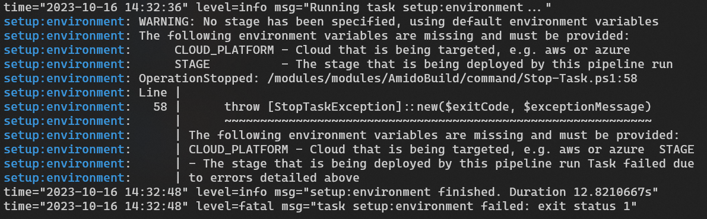

:cloud-platform: aws
:chef-license: accept-silent
:tests-path-tf-state: /app/src/terraform_state/tests

=== AWS

This section shows how to setup the necessary infrastructure on AWS.

==== Authentication

In order for Terraform to deploy to AWS, it needs to credentials. These are supplied as environment variables:

- AWS_ACCESS_KEY_ID
- AWS_SECRET_ACCESS_KEY
- AWS_REGION

The following examples assume that the access keys used are the ones that belong to the IAM user. If additional keys are required please refer to https://docs.aws.amazon.com/IAM/latest/UserGuide/id_credentials_access-keys.html[Managing AccessKeys for IAM Users]

Once the key have been retrieved set the values for the environment variables as shown above.

==== Creating the Terraform State resources

The independent runner will be used to create the resources which will be used to store the Terraform state for future infrastructure runs. A number of environment variables are required to ensure that the correct templates are used and AWS is targeted.

The independent runner has a mechanism that allows it to display which environment variables are required, so just running `taskctl infrastructure` should produce output similar to the following.

.Initial independent runner execution

In this case the runner has detected that three environment variables are missing, please refer to <<Environment Variables>> for a full list of the variables that can be set.

NOTE: Due to the way in which the templates are deployed setting these variables may mean that additional variables need to be set, but this will only be displayed once these initial variables are configured.

Set the environment variables accordingly.

[options="header",cols="1a,1a"]
|====
| Bash | PowerShell
| 
[source,bash]
----
export CLOUD_PLATFORM="{cloud-platform}"
export TESTS_PATH="{tests-path-tf-state}"
export CHEF_LICENSE="{chef-license}"
export STAGE="terraform_state"
---- | 
[source,powershell]
----
$env:CLOUD_PLATFORM = "{cloud-platform}"
$env:TESTS_PATH = "{tests-path-tf-state}"
$env:CHEF_LICENSE = "{chef-license}"
$env:STAGE = "terraform_state"
----
|====

When the command is run again another set of variables that are required will be displayed.

NOTE: The AWS credential variables have not be displayed because they were set in the authentication section above.