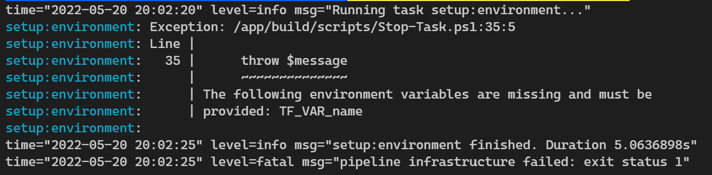

== Deployment

Setting up the infrastructure is a two step process. The first one deploys the storage for the Terraform state and the second one deploys the dependent infrastructure for Stacks.

The process for running each one is very similar, the only difference is the configuration for each deployment. The following subsections describe the configuration and how to perform the deployments.

Taskctl needs to know what stage of the pipeline to run so that the environment setup can be confirmed. To do this an environment variable called `STAGE` meeds to be configured. For this repository this needs to be set to either `terraform_state` or `ancillary_resources`.

In both cases the pipeline uses the `build/config/stage_envvars.yml` file to determine what environment variables are required for each stage pipeline. If theses environment variables are not set an error similar to the following will be displayed.

.Missing environment variables for the `terraform_state` stage

There are times when default variables need to be checked for that apply to all stages, one such example of this are the credentials for the cloud. The file that determines what environment variables should exist, and therefore fail the build early if they do not, is `build/config/stage_envvars.yml`.

The following table shows the environment variables that need to be configured regardless of which pipeline is being executed.

.Common environment variables for all stages, dependent on Cloud platform
[options="header"]
|====
| Name | Description | Cloud | Example
| AZURE_CLIENT_ID | ID of the Service Principal (SP) that will be used to perform the deployment | `decc1b38-9e04-45df-81db-06fae6f5c192` | Azure
| AZURE_CLIENT_SECRET | Secret associated with the SP | ljjk9887df;llkmkiojoijio | Azure
| AZURE_SUBSCRIPTION_ID | Subscription which the SP belongs to | 61296901-b864-4045-8d19-ef84984d4662 | Azure
| AZURE_TENANT_ID | Tenant that the subscription belongs to | Azure
|====

NOTE: Only default variables and the credentials that apply to the cloud being deployed to need to be configured.

=== Terraform State

The following environment variables must be set in order for the storage resources to be deployed.

.Required environment variables for Terraform state
[options="header"]
|===
| Name | Description | Example
| ENV_NAME | Used by Terraform to determine the workspace to work under | `dev`
| TF_FILE_LOCATION | Location of the templates to use.
All tasks are run in a container with the repository root mapped to `/app` in the container. | `/app/src/terraform_state/templates/azure`
| TF_BACKEND_INIT | The arguments to pass to Terraform when initializing the templates

As this is the first set of resources to be deployed there is no remote storage for the state to be stored in, so the backend is configure with  | `false`
| TF_BACKEND_PLAN | Arguments to pass to TF for the plan stage. Terraform will attempt to ask for the variables that are missing, but there is no interactive session available so this is turned off. | `-input=false,-out=tfplan`
| TF_VAR_name | Name of the company or project to be used in the name.

The name of the storage account is derived from several items, this being one of them. It is used to try and ensure the storage is globally unique | `turtle`
|===

After these environment variables have been configured, the pipeline can be run.

