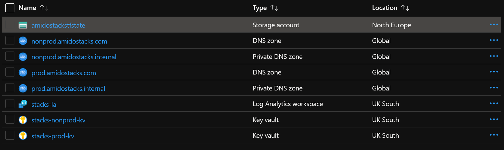

== Introduction

This repository contains the Terraform templates that are used to setup the initial configuration for running Amido Stacks. It is intended that the templates in this repository are run before any Amido Stacks component is deployed. The following lists the components that are deployed.

- Resource Group - creates the resource group that all resources will be deployed into
- Log Analytics Workspace - used for Azure monitoring
- Azure Key Vault - for the storage of secrets that can be used by Azure DevOps etc
- DNS Zones (public and private) - zones that will be updated as resources and applications are deployed
- Azure Monitor
- Storage Account - used to store the state for Terraform

The following screenshot shows an example of the resources as they are seen in the Azure portal.

.Resources in Azure

