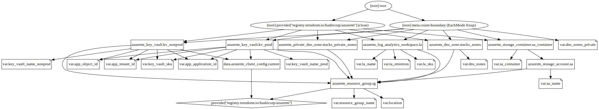

== Terraform State

All of the Amido Stacks projects use a remote location for the Terraform state, e.g. Azure Storage Account or an S3 bucket for example. However this repository is the exception. This is because the storage account that will be used for the remote state is deployed by the templates in this repository.

It would be a catch 22 situation as Terraform needs to write to the storage account that already exists but this repo will need to save its state to an account that does not exist. For this reason the terraform state templates does not have a build because the state cannot easily be saved for updates at a later date.

To get around this problem, each of the resources defined in the templates need to be imported into a local state if _any_ modification is required.

NOTE: The following code snippet assumes that Terraform has been initialised.

[source,powershell]
----
# The Key Vault template expects to configure access for a SP
# These values must be set in order for the import process to work
$env:TF_VAR_app_tenant_id = "xxxx-xxxx-xxxx-xxxx"
$env:TF_VAR_app_object_id = "xxxx-xxxx-xxxx-xxxx"
$env:TF_VAR_app_application_id = "xxxx-xxxx-xxxx-xxxx"

# Set an environment variable for the subscription ID
$env:SUBSCRIPTION_ID = "xxxx-xxxx-xxxx-xxxx"

# Import each of the resources into the local state
terraform import azurerm_resource_group.rg /subscriptions/${env:ARM_SUBSCRIPTION_ID}/resourceGroups/Stacks-Ancillary-Resources
terraform import azurerm_storage_account.sa /subscriptions/${env:ARM_SUBSCRIPTION_ID}/resourceGroups/Stacks-Ancillary-Resources/providers/Microsoft.Storage/storageAccounts/amidostackstfstate
terraform import azurerm_storage_container.sa_container https://amidostackstfstate.blob.core.windows.net/tfstate
terraform import azurerm_log_analytics_workspace.la /subscriptions/${env:ARM_SUBSCRIPTION_ID}/resourceGroups/Stacks-Ancillary-Resources/providers/Microsoft.OperationalInsights/workspaces/stacks-la
terraform import azurerm_key_vault.kv_nonprod /subscriptions/${env:ARM_SUBSCRIPTION_ID}/resourceGroups/Stacks-Ancillary-Resources/providers/Microsoft.KeyVault/vaults/stacks-nonprod-kv
terraform import azurerm_key_vault.kv_prod /subscriptions/${env:ARM_SUBSCRIPTION_ID}/resourceGroups/Stacks-Ancillary-Resources/providers/Microsoft.KeyVault/vaults/stacks-prod-kv
terraform import --% azurerm_dns_zone.stacks_zones[\"nonprod.amidostacks.com\"] /subscriptions/${env:ARM_SUBSCRIPTION_ID}/resourceGroups/Stacks-Ancillary-Resources/providers/Microsoft.Network/dnszones/nonprod.amidostacks.com
terraform import --% azurerm_dns_zone.stacks_zones[\"prod.amidostacks.com\"] /subscriptions/${env:ARM_SUBSCRIPTION_ID}/resourceGroups/Stacks-Ancillary-Resources/providers/Microsoft.Network/dnszones/prod.amidostacks.com
terraform --% import azurerm_private_dns_zone.stacks_private_zones[\"nonprod.amidostacks.internal\"] /subscriptions/${env:ARM_SUBSCRIPTION_ID}/resourceGroups/Stacks-Ancillary-Resources/providers/Microsoft.Network/privateDnsZones/nonprod.amidostacks.internal
----

=== Terraform Graph

After the Terraform state has been configured, either by runinng it for the first time or importing the state, a graph of the resources can be generated. This is done with the following command:

.Generate Terraform Graph
[source,powershell]
----
terraform graph | dot -Tsvg -o ../docs/images/resources.svg
----

This will produce a diagram similar to the following:app-name:

